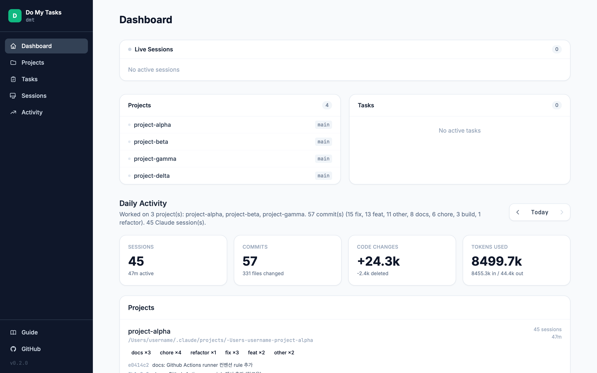
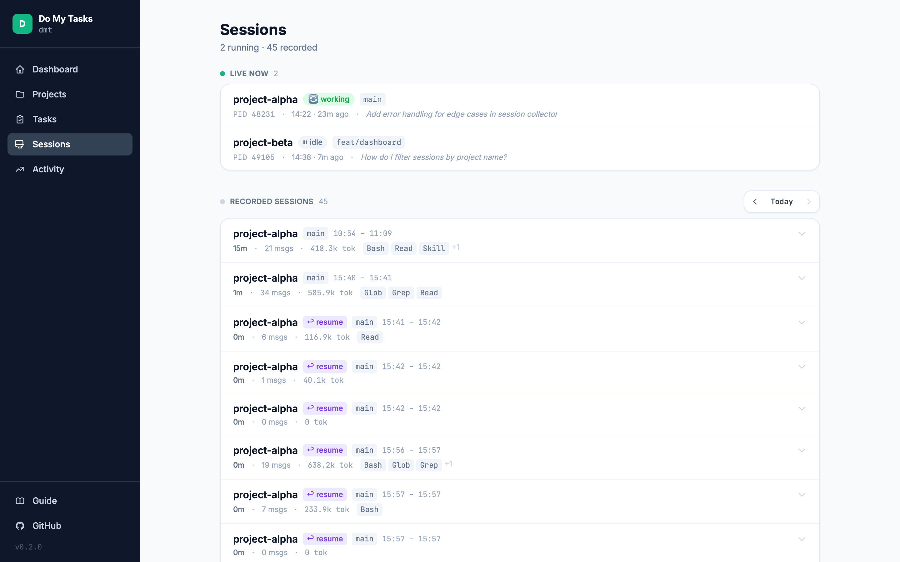
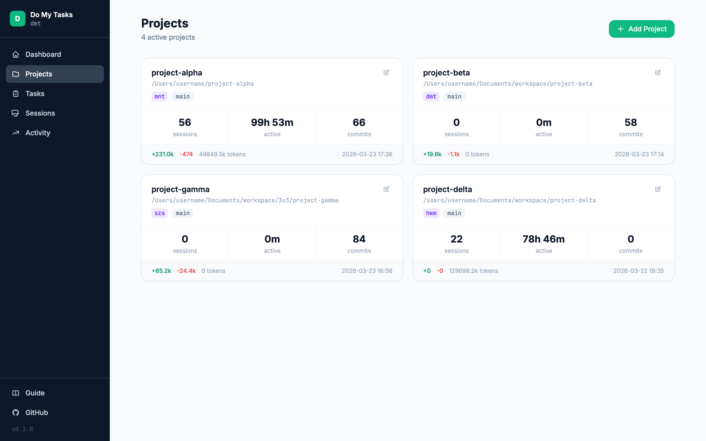
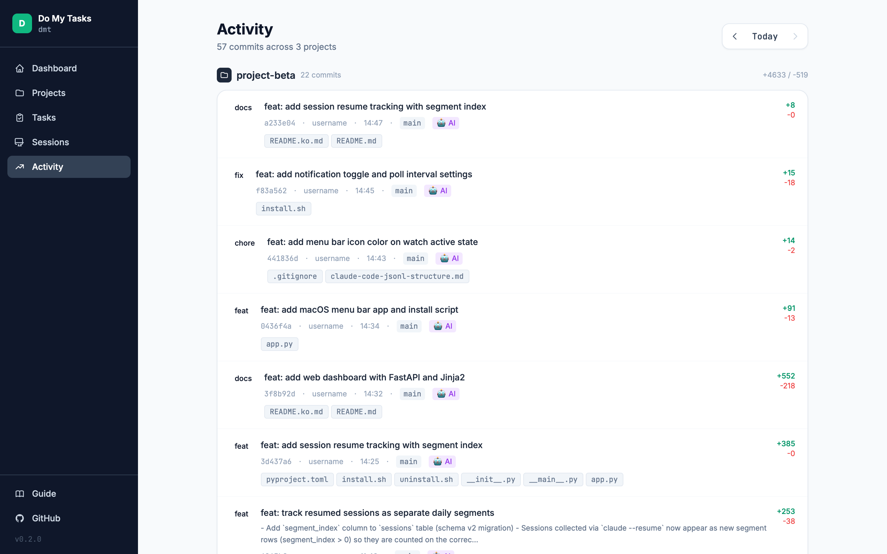

# DMT — Do My Tasks

**Claude Code 파워유저를 위한 지능형 일일 활동 추적 & 태스크 관리 도구**

Claude Code 세션 로그와 Git 커밋을 자동으로 수집하고, 우선순위 분석과 함께 태스크를 관리하며, 라이브 세션을 모니터링합니다 — CLI 하나 또는 웹 대시보드로 전부 가능합니다.

[English README →](README.md)

---

## 스크린샷

| 대시보드 | 세션 |
|---------|------|
|  |  |

| 프로젝트 | 활동 |
|---------|------|
|  |  |

---

## 스크린샷

| 대시보드 | 세션 |
|---------|------|
|  |  |

| 프로젝트 | 활동 |
|---------|------|
|  |  |

---

## 개요

DMT는 Claude Code의 세션 생명주기와 통합되어 오늘 무엇을 작업했는지, 무엇이 커밋되었는지, 무엇이 남아있는지를 한눈에 보여줍니다. 백그라운드에서 실행되며 세션 종료 시 자동으로 수집하고, 깔끔한 웹 UI 또는 터미널 명령어로 모든 정보를 제공합니다.

```
┌─────────────────────────────────────────────────────┐
│  Claude Code 세션 종료                              │
│       ↓  (Stop 훅)                                  │
│  dmt collect  →  JSONL 파싱 + Git 커밋 수집         │
│       ↓                                             │
│  SQLite DB  →  웹 대시보드 / CLI / 메뉴바 앱        │
└─────────────────────────────────────────────────────┘
```

---

## 설치

### macOS — 원라인 설치 (권장)

```bash
curl -fsSL https://raw.githubusercontent.com/HuanSuh/do-my-tasks/main/scripts/install.sh | bash
```

설치 스크립트가 자동으로 처리하는 것들:
1. `pipx`로 패키지 설치 (없으면 `pip` 폴백)
2. `/Applications/DoMyTasks.app` 생성 — 경량 상태바 앱
3. 로그인 시 자동 시작을 위한 LaunchAgent 등록
4. Claude Code `Stop` 훅에 `dmt collect` 자동 추가

설치 후 메뉴바에서 **◆** 아이콘을 찾으세요.

### 수동 설치 (개발 / non-macOS)

```bash
git clone https://github.com/HuanSuh/do-my-tasks.git
cd do-my-tasks
poetry install
poetry run dmt --version
```

### 요구사항

- Python 3.11 이상
- macOS (메뉴바 앱 기능); Linux/Windows는 CLI만 지원
- Git (커밋 분석용)

### 제거

```bash
bash scripts/uninstall.sh
```

---

## 빠른 시작

```bash
# 1. 프로젝트 등록
dmt config discover           # ~/.claude/projects/ 에서 자동 탐색
dmt config add /path/to/repo  # 또는 수동 등록

# 2. 오늘 활동 수집
dmt collect

# 3. 요약 확인
dmt summary

# 4. 웹 대시보드 열기
dmt web
```

---

## Claude Code 훅 설정

DMT는 Claude 세션이 종료될 때 자동으로 수집합니다. 설치 스크립트가 자동으로 설정하지만, `~/.claude/settings.json`에 직접 추가할 수도 있습니다:

```json
{
  "hooks": {
    "Stop": [
      {
        "matcher": "",
        "hooks": [{ "type": "command", "command": "dmt collect" }]
      }
    ]
  }
}
```

---

## 메뉴바 앱

macOS 상태바 앱으로 터미널 없이 빠르게 접근할 수 있습니다:

| 메뉴 항목 | 기능 |
|-----------|------|
| **Open Dashboard** | `http://127.0.0.1:7317` 브라우저로 열기 |
| **Session Watch: OFF / ON** | 실시간 세션 모니터링 토글 |
| **Notifications** | macOS 알림 활성/비활성 토글 (체크마크) |
| **Poll Interval ▶** | 폴링 주기 선택: 5s / 10s / 30s / 60s (현재값 체크마크) |
| **Quit DMT** | 모든 백그라운드 프로세스 종료 |

- 앱 실행 시 웹 서버가 백그라운드에서 자동 시작
- Watch 모드 활성 시 아이콘이 **◆●** 로 변경
- LaunchAgent로 등록 — 로그인 시 자동 시작
- 설정(알림, 폴링 주기)은 `~/.config/do_my_tasks/menubar.json`에 저장되어 재시작 후에도 유지
- Watch 실행 중 설정 변경 시 즉시 반영 (수동 재시작 불필요)

---

## CLI 레퍼런스

### `dmt collect`

지정된 날짜의 Claude Code 세션 로그와 Git 커밋을 파싱합니다.

```bash
dmt collect                        # 오늘
dmt collect --date 2026-03-15      # 특정 날짜
dmt collect --project myapp        # 특정 프로젝트만
```

**수집 대상:**
- Claude 세션: 메시지 수, 사용한 도구, 토큰 사용량, 세션 시간, cwd, git 브랜치
- Git 커밋: 작성자, 메시지, 변경 파일, 추가/삭제 라인 수, 커밋 타입
- **Resume 세그먼트:** `claude --resume <uuid>`로 재개된 세션의 새 활동을 별도 일별 항목으로 저장 (원본 세션과 연결)

---

### `dmt summary`

일일 활동 리포트를 생성합니다.

```bash
dmt summary                        # 터미널에 출력
dmt summary --save                 # ~/.config/do_my_tasks/reports/ 에 저장
dmt summary --date 2026-03-15
```

리포트 내용: 프로젝트별 통계, 토큰 사용량, 코드 변경사항, 태스크 진행 현황.

---

### `dmt plan`

최근 커밋과 태스크를 기반으로 우선순위가 정렬된 TODO 목록을 생성합니다.

```bash
dmt plan                           # 플랜 출력
dmt plan --save                    # DB에 태스크로 저장
```

롤오버된 태스크, 고우선순위 항목(커밋 분석 기반), 추천 후속 작업 세 가지 섹션으로 구성됩니다.

---

### `dmt sessions`

실행 중인 Claude Code 프로세스를 모니터링합니다.

```bash
dmt sessions                       # 실행 중인 세션 목록
dmt sessions --detail              # 마지막 메시지, 도구, 파일 표시
dmt sessions watch                 # 실시간 모니터링 + 알림
dmt sessions watch --idle 20       # 커스텀 유휴 감지 임계값 (초)
dmt sessions clean                 # 유휴 세션 대화형 정리
dmt sessions clean --force         # 확인 없이 모든 유휴 세션 종료
```

**세션 상태:**

| 상태 | 의미 |
|------|------|
| `idle` | 사용자 입력 대기 중 |
| `permission` | 도구 승인 대기 중 |
| `working` | 요청 처리 중 |
| `waiting` | 세션 열림, 아직 활동 없음 |

**Watch 모드**는 세션을 폴링하고 macOS 알림을 전송합니다:
- ✅ **완료** — 작업 내용 + 다음 태스크 제안
- ⏸️ **권한 필요** — 승인 대기 중인 도구 표시

---

### `dmt tasks`

일별 태스크를 관리합니다.

```bash
dmt tasks add "로그인 버그 수정" --priority high --project myapp
dmt tasks list
dmt tasks list --status pending --project myapp
dmt tasks complete T-0001
dmt tasks update T-0001 --priority high
dmt tasks delete T-0001
dmt tasks rollover                 # 미완료 태스크를 오늘 날짜로 이월
```

태스크 ID는 `T-0001` 형식입니다. 우선순위: `high`, `medium`, `low`. 상태: `pending`, `in_progress`, `completed`.

---

### `dmt config`

등록된 프로젝트와 설정을 관리합니다.

```bash
dmt config discover                # 프로젝트 자동 탐색
dmt config add /path/to/repo       # 프로젝트 등록
dmt config add /path --name myapp --branch develop
dmt config remove myapp
dmt config list                    # 등록된 프로젝트 목록
dmt config show                    # 전체 설정 표시
```

---

### `dmt web`

웹 대시보드를 실행합니다.

```bash
dmt web                            # http://127.0.0.1:7317
dmt web --port 8080
dmt web --no-open                  # 브라우저 자동 열기 비활성화
```

---

### 전역 옵션

```bash
dmt --verbose collect              # 디버그 로그 출력
dmt --json tasks list              # JSON 형식 출력
dmt --version
```

---

## 웹 대시보드

| 페이지 | URL | 설명 |
|--------|-----|------|
| Dashboard | `/` | 오늘 개요: 세션, 커밋, 태스크, 라이브 활동 |
| Tasks | `/tasks` | 태스크 생성/완료, 프로젝트·상태·날짜 필터 |
| Sessions | `/sessions` | 라이브 세션 + 기록된 세션 이력 (resume 추적 포함) |
| Activity | `/activity` | 프로젝트별 커밋 이력 |
| Projects | `/projects` | 프로젝트 통계 및 관리 |
| Guide | `/guide` | 내장 문서 (한국어 / English) |

---

## 우선순위 스코어링

커밋 우선순위는 4가지 신호로 자동 계산됩니다:

| 신호 | 가중치 | 판단 기준 |
|------|--------|-----------|
| 키워드 | 40% | fix, bug, security, urgent → 높음; chore, docs → 낮음 |
| 변경 규모 | 30% | 추가 + 삭제 라인 수 |
| 파일 중요도 | 20% | auth, config, schema, migration 파일은 높은 가중치 |
| 시간 | 10% | 최근일수록 높은 점수 |

임계값: **HIGH** > 7.5 · **MEDIUM** > 4.0 · **LOW** ≤ 4.0

가중치와 키워드는 `~/.config/do_my_tasks/config.toml` 에서 직접 설정할 수 있습니다.

---

## 세션 Resume 추적

`claude --resume <uuid>`를 실행하면 Claude가 기존 세션 파일에 새 메시지를 추가합니다. DMT는 이를 감지하여 재개된 활동을 오늘 날짜에 새 **세그먼트**로 저장합니다 — 덕분에 멀티데이 세션에서도 일별 통계가 정확하게 유지됩니다.

- 세그먼트 0 = 원본 세션
- 세그먼트 1, 2, … = 각 resume
- 웹 대시보드 Sessions 페이지에서 **↩ resume** 뱃지로 표시

---

## 데이터 저장 위치

| 항목 | 경로 |
|------|------|
| 데이터베이스 | `~/.config/do_my_tasks/data.db` |
| 설정 파일 | `~/.config/do_my_tasks/config.toml` |
| 리포트 | `~/.config/do_my_tasks/reports/YYYY-MM-DD.md` |
| Watch 로그 | `~/.dmt/logs/dmt_watch_log_*.log` (5일 후 자동 삭제) |

`DMT_DB_PATH` 환경변수로 데이터베이스 경로를 변경할 수 있습니다.

---

## 프로젝트 구조

```
src/do_my_tasks/
├── cli/commands/       # collect, summary, plan, tasks, sessions, config, web
├── core/               # collector, session_parser, git_analyzer, task_manager
├── intelligence/       # summarizer, priority_analyzer, todo_generator
├── menubar/            # macOS 상태바 앱 (rumps)
├── models/             # Pydantic 도메인 모델
├── storage/            # SQLAlchemy ORM + Repository 패턴
├── web/                # FastAPI 앱 + Jinja2 템플릿
└── utils/              # 설정 로더, 로깅
```

---

## 개발

```bash
poetry install
poetry run pytest
poetry run ruff check src/
poetry run mypy src/
```

---

## 라이선스

MIT
